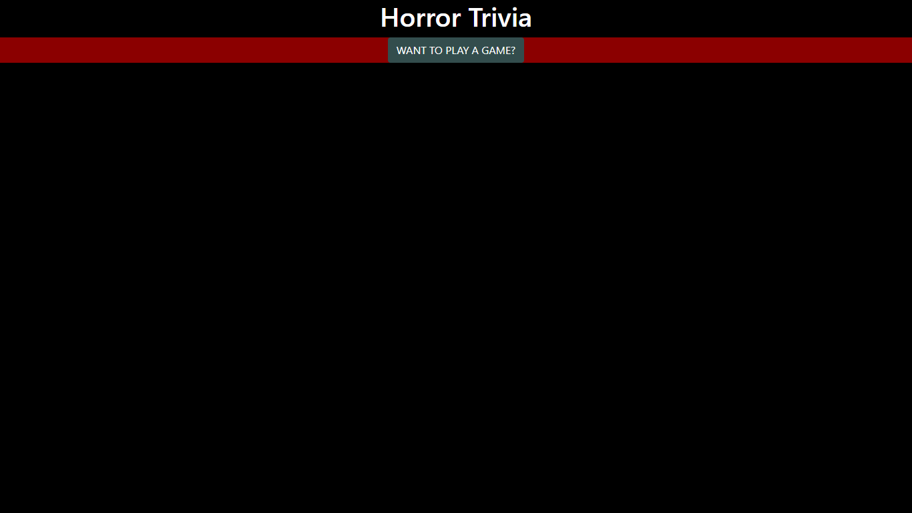

# Trivia Game
Horror movie trivia game with a timer.

# Link
https://swedishkinda.github.io/TriviaGame/

# Problem
Create an app that has a timer, way to submit answers, and tally up correct/incorrect answers to be shown to user.

# Solution
Made an array that has all questions with answers and correct answers stored as objects. Then made a variable that sets correct, incorrect, and timer at starting values as an object. Then inside said object I made four functions. 
- The first function(countdown) handles the countdown and the alert for running out of time. 
- The second function(start) handles the start of the game.
    - When the user clicks the start button it starts the timer at a set interval at 1s(1000ms)
    - Removes start screen and displays timer display
    - Uses two for loops to display all questions and answers with append
    - Appends a "Done" button
- The third function(done) handles all the tallying up of the score based on correct and incorrect answers
- The fourth function(results) handles the display of the results screen

# Bug fix
Couldn't get end screen to append because I was removing whole div and patched problem with adding a whole new div and appending end screen to that instead.

# Tech
- jQuery
- Timer
- JavaScript
- HTML 5
- CSS 3

# Instructions
Click radio buttons next to answers then hit submit before timer runs out. Then a score will display with correct, incorrect, unanswered, and time taken. IF TIME RUNS OUT AND ALERT POPS UP CLICK "Ok" TO BRING UP END SCREEN.

# How to Edit
- Click on green button that says "Clone or download"
- Download zip then extract all
- Then open in text editor of your choice
- If you want to run app locally just open index.html in your default browser

# Prequisites
Just make sure you have a current updated browser.
